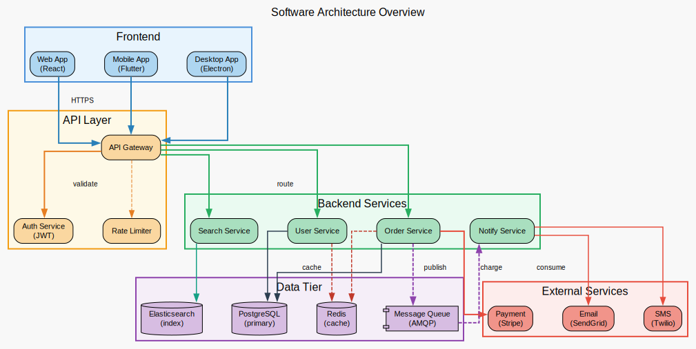
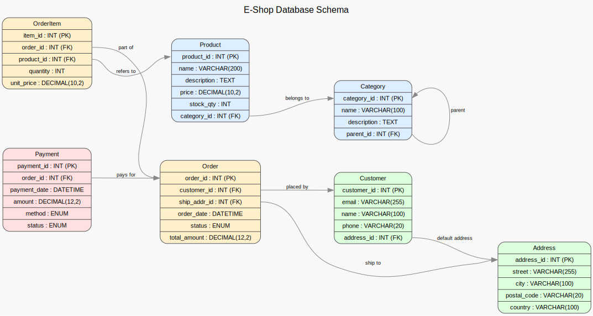

# Eclipse DOT Support

[](https://github.com/crimaniak/eclipse_dot_support/actions/workflows/build.yml)

An Eclipse plugin that adds full editing and rendering support for [Graphviz](https://graphviz.org/) DOT files (`*.dot`, `*.gv`).

## Features

### DOT Language Editor

- **Syntax highlighting** — keywords, attributes, strings, and comments are colored distinctly
- **Auto-completion** — context-aware suggestions for keywords (`graph`, `digraph`, `subgraph`, `node`, `edge`, `strict`), 40+ common attributes, 20+ node shapes, and edge styles
- **Outline view** — hierarchical tree of graphs, subgraphs, nodes, and edges, updated as you type

### Graph Preview

A dedicated **DOT Graph View** renders the graph and updates it whenever a `.dot` file is opened or saved.

- **SVG rendering** with interactive pan and zoom (mouse wheel + drag)
- **PNG rendering** as a fallback
- **Zoom controls**: Zoom In, Zoom Out, Fit to Window
- **Save to disk**: export the rendered image as SVG or PNG

### Graphviz Integration

- Automatically detects Graphviz on the system `PATH`
- Configurable Graphviz installation path via **Preferences > DOT Support**
- Shows detected executable path and version in the Preferences page

## Screenshots

| Editor with syntax highlighting | Graph preview |
|---|---|
|  |  |

## Requirements

- Eclipse IDE (2023-03 or later recommended)
- Java 21+
- [Graphviz](https://graphviz.org/download/) installed on the system

## Installation

### From source (local P2 update site)

1. Clone the repository:
   ```bash
   git clone https://github.com/crimaniak/eclipse_dot_support.git
   cd eclipse_dot_support
   ```

2. Build the update site (requires Maven 3.9+):
   ```bash
   cd eclipse_dot_support.parent
   mvn clean package
   ```

3. In Eclipse, open **Help > Install New Software**.

4. Click **Add > Local** and select the `eclipse_dot_support.site/target/repository/` directory.

5. Select **DOT Support** and complete the installation wizard.

6. Restart Eclipse when prompted.

### Maven build inside Eclipse (m2e)

Requires the [m2e](https://eclipse.dev/m2e/) plugin (bundled with Eclipse IDE for Java Developers).

1. Right-click the `eclipse_dot_support.parent` project → **Run As > Maven build…**
2. Set Goals to `clean package` and click **Run**.
3. Follow steps 3–6 from the section above.

## Configuration

Open **Preferences > DOT Support** to configure:

| Setting | Description |
|---|---|
| **Graphviz path** | Directory containing the `dot` executable, if not on the system `PATH` |
| **Output format** | `SVG` (default, supports pan/zoom) or `PNG` |

## Project Structure

```
eclipse_dot_support/
├── eclipse_dot_support.parent/   # Maven parent POM + target platform
├── eclipse_dot_plugin/           # Plugin source (editor, view, preferences)
├── eclipse_dot_support/          # Eclipse feature descriptor + examples
└── eclipse_dot_support.site/     # P2 update site builder
```

## Building

The build uses [Eclipse Tycho](https://eclipse.dev/tycho/) and targets Java 21. Run from the parent directory:

```bash
cd eclipse_dot_support.parent
mvn clean package
```

The installable update site is produced at `eclipse_dot_support.site/target/repository/`.

## License

[Eclipse Public License 2.0](eclipse_dot_support.parent/LICENSE)
